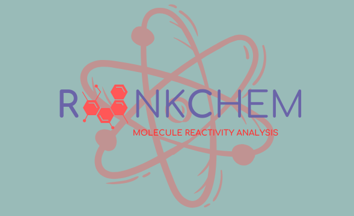
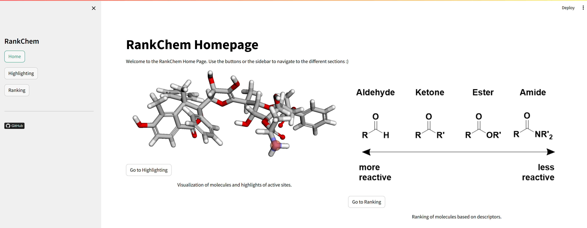
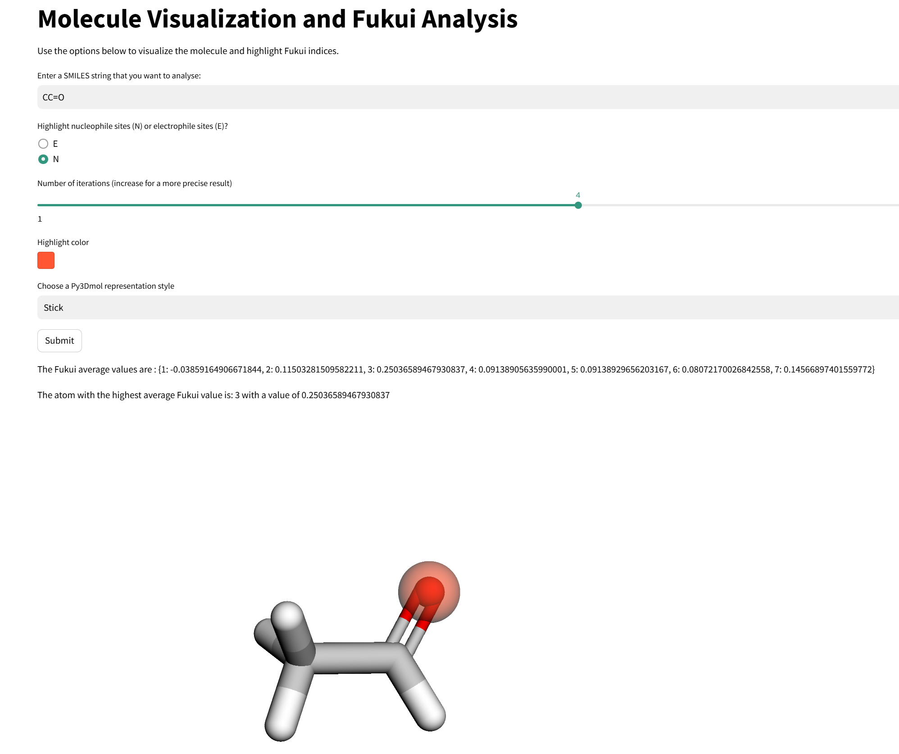
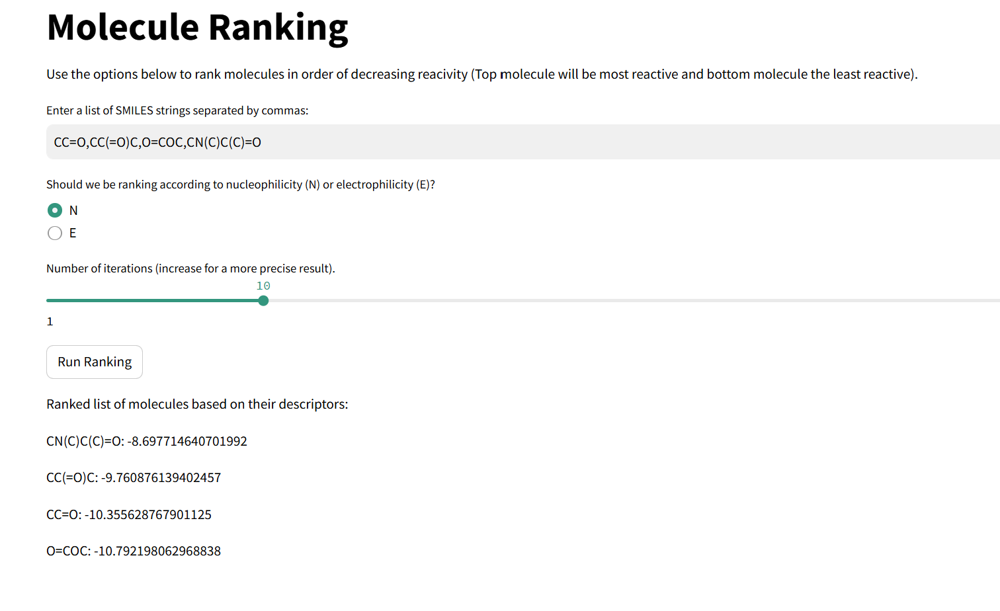

# ChemInterface for Reactivity Analysis
### Project in the *Practical programming in chemistry* course EPFL CH-200
[](https://www.python.org)

[](https://jupyter.org/)


## 🔥 Usage

This repository provides the user with a package which will display an interactive interface where the user will be able to analyse the reactivity of meolecules based on their electrophilicity or nucleophilicity. The package leads the user to a streamlit hompage. Two features are available. The first one enables the user to visulaize a molecule in 3D with the reactive site highlighted. The second feature ranks multiple molecule in the order of decreasing reactivity based on descriptors. Both these feature were made using XTB calculations.

The developpers of this package are:
- Ludovica Fracassi, 2nd year Bachelor student in Chemistry and Chemical engeneering at EPFL [](https://github.com/fracaludo)
- Emma Kappeler, 2nd year Bachelor student in Chemistry and Chemical engeneering at EPFL [](https://github.com/kappelemma)


Before installing everything, let's first define electrophilicity and nucleophilicity!!

**What is electrophilicity and nucleophilicity ?**

Electrophilicity and nucleophilicity are fundamental concepts in organic chemistry that describe the reactivity of molecules. Electrophilicity refers to the ability of a molecule or ion to accept an electron pair, making it an electron-loving species (electrophile). Electrophiles typically have a positive charge, partial positive charge, or an electron-deficient atom, making them attracted to electron-rich regions. On the other hand, nucleophilicity describes the ability of a molecule or ion to donate an electron pair, making it an electron-rich species (nucleophile). Nucleophiles are usually negatively charged or have lone pairs of electrons, such as anions, amines, and alcohols. The interaction between nucleophiles and electrophiles drives many chemical reactions, particularly in organic synthesis, where nucleophiles attack electrophiles to form new bonds.

Now let's go through the steps required to use this package.

## 👩‍💻 Installation

❗ Before installing the package and all the dependencies, do not forget to create a new conda environment to prevent dependency conflicts and to keep the project isolated. This can be done by executing the folowing command:

```bash
conda create --name myenv python=3.10
conda activate myenv
```
Where myenv is the name of your environment.

The package runs on python 3.10 but supports python 3.8 through 3.10.
RankChem can be installed using pip as followed:

```bash
pip install Rankchem
```

The package can also be installed from source by running the following commands:

First, clone the repository from Github and go in the RankChem folder.

```bash
git clone [https://github.com/fracaludo/RankChem.git]
cd RankChem
```

Then, install the package using :

```bash
pip install -e .
```

Tha package can also be installed directly from Github via pip by executing the following command:

```bash
pip install git+https://github.com/fracaludo/RankChem.git
```


#### Required packages


In order to run the package correctly, the following packages need to be installed using the following commands.

❗ xtb-python only works for IOS and Linux. If you are using Windows, you should install Ubuntu. Further information is available on: https://ubuntu.com/desktop/wsl

Libblas and xtb-python are not pip installable, however, you can install them by running the following commands in your terminal:

```bash
conda install "libblas=*=*mkl"
conda install xtb-python
```

When installing the RankChem, the necessary dependencies should be installed automatically. However, if the dependencies are not installed as expected, please ensure you install the following packages by executing the following commands:
 
```bash
conda install -c conda-forge morfeus-ml
conda install -c conda-forge rdkit
conda install -c conda-forge pyvistaqt
conda install -c conda-forge numpy
conda install -c conda-forge py3Dmol
conda install -c streamlit
conda install -c stmol
```

Specifically, from these packages, the following subpackages are required:

```bash
import streamlit as st
from rdkit import Chem
from rdkit.Chem import AllChem, rdDistGeom
from morfeus import read_xyz, XTB
from stmol import showmol
import py3Dmol
```

## 🎥 How it works

This project hase an interface based UI to interact with the functions. In order to use it, go to the directory where you cloned the repository and run the following commands in your terminal:
```bash
streamlit run app.py
```
The user then arrives to the RankChem Homepage where they can choose which feature they want to use.

OR just jump to the *🚥 Let's get started!* section below and click on the streamlit badge.



The Highlight feature enables the user to input the smiles of a molecule and choose if nucleophilicity or electrophilicity is highlighted. The interface will then display the molecule in 3D with the chosen site highlighted. The user can also choose the visualiation style and the number of iterations in order to get a more precise result. The Fukui values of each atom will also be displayed. An example of the input and output is shown below:



Lastly, the Ranking feature enable the user to input multiple smiles and again choose if nucleophilicity or electrophilicity is analysed. The interface will then return the moelcules with highest: the most electrophile/nucleophile molecule and lowest the least electrophile/nucleophile molecule. Their corresponding descriptors values are also displayed. An example is shown below:



More information on the usage and limitations of the package can be found in our [jupyter notebook based report]https://github.com/fracaludo/RankChem/blob/main/notebooks/project_report.ipynb 📓

## 🚥 Let's get started!

The streamlit interface can now finally be used!!

Just click on the logo below ;)

[](https://rankchem.streamlit.app/)

## 🔎 References an documentation

Here is some useful reading on the packages that we used to create this project.

https://digital-chemistry-laboratory.github.io/morfeus/
https://github.com/digital-chemistry-laboratory/morfeus
https://github.com/napoles-uach/stmol
https://xtb-python.readthedocs.io/en/latest/index.html#


